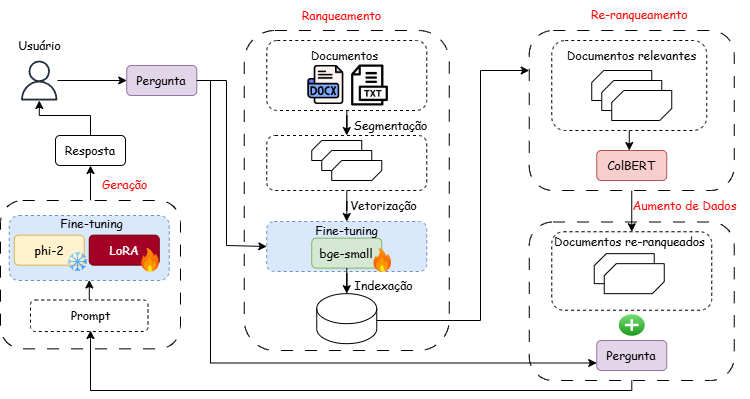

# 📡 Aprimorando RAG para Telecomunicações com Modelos Leves  

Os modelos de linguagem são eficazes em diversas tarefas de processamento de texto, mas enfrentam dificuldades em domínios especializados, como telecomunicações, devido à complexidade técnica e constante evolução dos padrões. Para solucionar esse problema, este estudo aprimora um sistema de **Recuperação e Geração Aumentada (RAG)** adaptado para responder perguntas sobre as especificações **3GPP**, um conjunto de normas fundamentais para redes móveis.  

A abordagem proposta utiliza **modelos leves** para equilibrar desempenho e eficiência computacional. O modelo **bge-small-en-v1.5** é ajustado para recuperar informações técnicas com maior precisão, enquanto o modelo **phi-2** passa por um fine-tuning para gerar respostas mais precisas e contextualizadas. Para otimizar esse processo, os documentos técnicos são segmentados estrategicamente e armazenados em um banco de dados vetorial **FAISS**, permitindo buscas eficientes. Além disso, um re-ranqueador baseado no modelo **ColBERT** refina a seleção dos documentos mais relevantes, e um índice especializado de abreviações do **3GPP** enriquece a compreensão do contexto técnico.  

Os experimentos demonstraram um **aumento de 22,38% na precisão das respostas**, tornando a solução escalável e viável para aplicações reais no setor de telecomunicações. Essa abordagem reduz os custos computacionais e possibilita a implementação em ambientes com recursos limitados. Como próximos passos, a pesquisa pretende expandir a base de conhecimento e aprimorar a estratégia de re-ranqueamento para continuar melhorando a precisão do sistema.  





## 📌 Modelos Ajustados  

- **[bge-small-en-v1.5](https://huggingface.co/dinho1597/bge-small-qa-telecom-ft)** → Modelo de embeddings ajustado para recuperação de informações técnicas.  
- **[phi-2](https://huggingface.co/dinho1597/phi-2-telecom-ft-v1_test)** → Modelo gerador ajustado para fornecer respostas mais precisas.  

## 📊 Conjuntos de Dados Utilizados  

- **[TeleQnA](https://huggingface.co/datasets/dinho1597/3GPP-QA-MultipleChoice)** → Conjunto com 10.000 perguntas sobre telecomunicações, categorizadas em léxico, pesquisa e especificações 3GPP.  
- **[3GPP QA RAG](https://huggingface.co/datasets/dinho1597/3GPP_QA_RAG)** → Dataset personalizado com perguntas, respostas, e documentos técnicos do **3rd Generation Partnership Project (3GPP)**.  


## 🎯 Ajustando o Modelo de Embeddings  

Para realizar o **fine-tuning** do modelo de embeddings **bge-small-en-v1.5**, utilizamos um ambiente como **Google Colab** ou **Jupyter Notebook**. A seguir, apresentamos os passos necessários para configurar e treinar o modelo.  

###  Ajuste Fino do embedding

1️⃣ **Clonar o repositório**
O primeiro passo é baixar o código do repositório contendo os scripts necessários:  
```bash
!git clone https://github.com/DinhoVCO/RAG_3GPP.git
```
2️⃣ **Instalar as dependências**
```bash
!pip install -r /RAG_3GPP/fine_tuning/requirements.txt 
```
3️⃣ **Executar o script de ajuste fino**
```bash
!python /RAG_3GPP/fine_tuning/embedding_ft.py --epoch 5 --batch_size 16 --output_dir "/RAG_3GPP/models"
```
📌 Nota: Você pode modificar os parâmetros --epoch e --batch_size para ajustar o tempo de treinamento e o consumo de memória.

## 🏆 Avaliação do Modelo de Embeddings  

```bash
!git clone https://github.com/DinhoVCO/RAG_3GPP.git
!pip install -r /RAG_3GPP/fine_tuning/requirements.txt --quiet
!python /RAG_3GPP/evaluation/evaluate_embedding_ir.py --output_dir "/RAG_3GPP/results" --models_dir "/RAG_3GPP/models/embedding"
```

## Index FAISS 
```bash
!git clone https://github.com/DinhoVCO/RAG_3GPP.git
!pip install -r /RAG_3GPP/fine_tuning/requirements.txt --quiet
!python /RAG_3GPP/data/faiss_index.py --dataset "dinho1597/3GPP-docs-100cs" --output "/RAG_3GPP/index"
```

## Ajuste Fino Lora phi-2
```bash
!git clone https://github.com/DinhoVCO/RAG_3GPP.git
!pip install -r /RAG_3GPP/fine_tuning/requirements.txt --quiet
!python /RAG_3GPP/fine_tuning/language_model_ft.py --new_model_name "phi-10e-5bs" --num_epochs 10 --batch_size 5 --save_path "/RAG_3GPP/models/adapters" --train_dataset_name "dinho1597/3GPP_QA_RAG"
```

## RAG Inference 
Você tem diferentes testes na pasta **run**, basta criar um novo arquivo `.sh` com as configurações para a inferência.  

Exemplo:
```bash
!git clone https://github.com/DinhoVCO/RAG_3GPP.git
!pip install -r /RAG_3GPP/RAG/requirements.txt --quiet
```
### Só phi-2

```bash
!bash /content/RAG_3GPP/run/phi_basic.sh
```

### Complete fine tuning RAG
```bash
!bash /content/RAG_3GPP/run/all_ft_abbre_rerank10_100cs.sh
```

## Evaluar Accuracy

```bash
!git clone https://github.com/DinhoVCO/RAG_3GPP.git
!pip install -r /RAG_3GPP/RAG/requirements.txt --quiet
!python /content/RAG_3GPP/evaluation/evaluate_answers.py --test_dataset "dinho1597/3GPP-QA-MultipleChoice" --save_path "/RAG_3GPP/results" --results_path "/RAG_3GPP/results/all_ft_abbre_rerank10_100cs_results.csv"
```